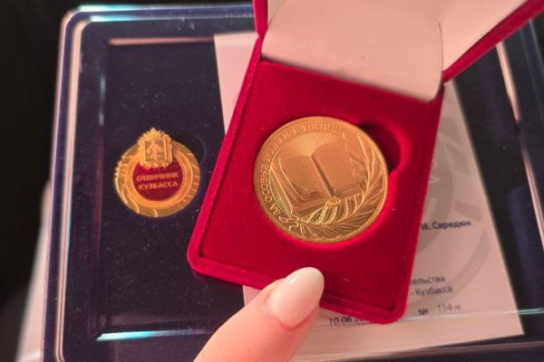
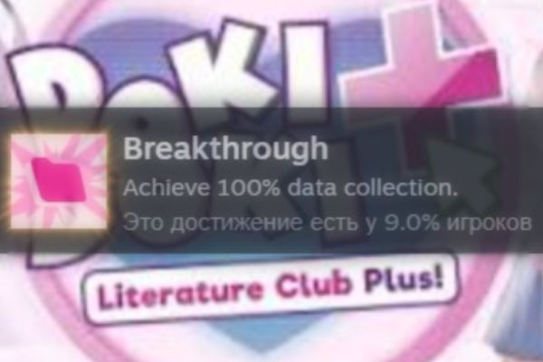

# veraitsi
<!DOCTYPE html>
<html lang="ru">
<head>
    <meta charset="UTF-8">
    <meta name="viewport" content="width=device-width, initial-scale=1.0">
    <title>Обо мне</title>
    
</head>
<body>
    <header>
        

            <h1>Обо мне</h1>
            
Привет! Меня зовут Вера. Мне 18 лет. Я приехала из Кемеровской области.

	    
        

    </header>
    
    <section class="about-section">
        

<h2 class="section-title">Мои хобби</h2>
            

                
Моим главным хобби является рисование, но, в связи с наступлением учебы в университете, я стала меньше этим заниматься(

                
Были попытки в гитару, но мотивации не хватило, и я так и не научилась(

            

        

    </section>
    
    <section>
        

            <h2 class="section-title">Мои интересы и учёба</h2>
            

                

                    
                    

                        <h3>Мои заслуги</h3>
                        
Я закончила 11 классов с красным аттестатом и золотой медалью!

                    

                

                

                    
                    

                        <h3>Игра, которой горжусь</h3>
                        
Я выполнила это достижение спустя 15 после выхода игры

                    

                

                

                    
                    

                        <h3>Игра детства</h3>
                        
Игра, в которую я игра всё свое детство, пока она не стала донатной помойкой(

                    

                

            

        

    </section>
    
    <section>
        

            <h2 class="section-title">Контакты</h2>
            

                
Если хотите поболтать о том и о сем, то пишите(но я не отвечу).

                <a href="mailto:bepa.dash19@gmail.com" class="contact-btn">Моя почта</a>
		<a href="https://vk.com/hellothankyou" class="contact-btn">Мой ВК</a>
                

            

        

    </section>
    
    <footer>
        

            
&copy; Живите как хотите и жалейте об этом. 

        

    </footer>
</body>
</html>
